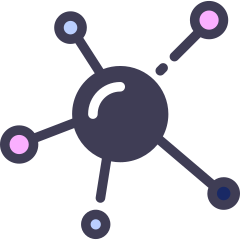

# :sparkles: Create Micro React App [](https://travis-ci.com/matheusmr13/create-microfrontend-react-app) [](https://dev.azure.com/matheusmr13/create-microfrontend-react-app/_build/latest?definitionId=2&branchName=master) [](https://sonarcloud.io/dashboard?id=matheusmr13_create-microfrontend-react-app)



Most complete approach to microfrontend architecture:

- Library to export and import microfrontends; [know more...](https://matheusmr13.github.io/create-micro-react-app/docs/core)
- Command line interface to create, development and release your app; [know more...](https://matheusmr13.github.io/create-micro-react-app/docs/cli)
- Backoffice to simplify all complexity needed; [know more...](https://matheusmr13.github.io/create-micro-react-app/docs/backoffice)
- Simple just like [Create React App](https://github.com/facebook/create-react-app).

If you want to know more about microfrontends and why you should (or shouldn't) use it, check [this article](https://matheusmr13.github.io/create-micro-react-app/docs/core/microfrontend).

## :zap: Quick Overview

```
  npx @cmra/cli create my-app
  cd my-app
  npm start
```

## :rocket: Demo

Microfrontend Store: [Demo](https://github.com/matheusmr13/micro-store)

## :floppy_disk: Installing

To install our cli you need **Node >= 13**.

### npm

```bash
  npm i -g @cmra/cli
```

### yarn

```bash
  yarn global add @cmra/cli
```

## :computer: Using it

After installing it, you'll have `cmra` command available:

```
  cmra create my-app
```

It will generate a folder structure like:

```bash
  my-app
  ├── package.json
  ├── packages
  |  ├── microfrontend # create-react-app structure folder
  |  |  ├── README.md
  |  |  ├── package.json
  |  |  ├── public
  |  |  |  ├── favicon.ico
  |  |  |  ├── index.html
  |  |  |  ├── logo192.png
  |  |  |  ├── logo512.png
  |  |  |  ├── manifest.json
  |  |  |  └── robots.txt
  |  |  ├── src
  |  |  |  ├── App.css
  |  |  |  ├── App.js
  |  |  |  ├── App.test.js
  |  |  |  ├── index.css
  |  |  |  ├── index.js
  |  |  |  ├── logo.svg
  |  |  |  ├── serviceWorker.js
  |  |  |  └── setupTests.js
  |  |  └── yarn.lock
  |  └── webapp # create-react-app structure folder
  |     ├── README.md
  |     ├── package.json
  |     ├── public
  |     |  ├── favicon.ico
  |     |  ├── index.html
  |     |  ├── logo192.png
  |     |  ├── logo512.png
  |     |  ├── manifest.json
  |     |  ├── microfrontends
  |     |  |  └── meta.json
  |     |  └── robots.txt
  |     ├── src
  |     |  ├── App.css
  |     |  ├── App.js
  |     |  ├── App.test.js
  |     |  ├── index.css
  |     |  ├── index.js
  |     |  ├── logo.svg
  |     |  ├── serviceWorker.js
  |     |  └── setupTests.js
  |     └── yarn.lock
  └── yarn.lock
```

## :hammer: Development

First of all, check our [contributing guide](https://github.com/matheusmr13/create-micro-react-app/blob/master/CONTRIBUTING.md).
If you have any questions just [open an issue](https://github.com/matheusmr13/create-micro-react-app/issues/new)!

## :books: Docs

https://matheusmr13.github.io/create-micro-react-app/docs/

---

Icon made by [Freepik](https://www.flaticon.com/authors/freepik) from [www.flaticon.com](https://www.flaticon.com/)
